<br><br><br><br>

# Introducción a GIT

<br><br>


<br><br>

## 1. ¿Qué es y para que se puede usar?

Git es un software de control de versionado, pensando en la eficiencia y la confiabilidad del mantenimiento de versiones de aplicaciones cuando éstas tienen un gran número de archivos.

Nos permite tomar un proyecto en el cual estamos trabajando de forma local (en nuestro equipo) y guardarlo de forma segura en un servidor remoto (probablemente internet). Con unos simples comandos nos permite sincronizar los archivos locales y remotos manteniendo un historial de las diferentes versiones. Con esto ultimo siempre tenemos la posibilidad de volver a una version anterior. También nos permite compartir los proyectos con otras personas, trabajar en equipos y muchas otras funcionalidades que no vamos a mencionar.

Pero, ¿donde exactamente se están guardando los proyectos?
Para esto existen varios sitios que ofrecen estos servicios (con planes tanto gratuitos, como pagos) por nombrar algunos tenemos:

* [GitHub](https://github.com)


* [GitLab](https://about.gitlab.com)


* [BitBucket](https://bitbucket.org)


En esta introducción a git vamos a utilizar [GitHub](https://github.com), asi que no tienes cuna cuenta, creala [aquí](https://github.com/join?source=header-home).

## 2. Instalación

1 - Descargar desde la [página oficial](https://git-scm.com/).


2 - Aceptar la Licencia


3 - Continuar dando next seleccionando las siguientes opciónes (deberían ser las por defecto)


4 - Para asegurarse de que la instalación fue exitosa se pueden seguir los siguientes pasos:

* Abrir al consola/powershell/terminal dependiendo del sistema operativo
* Pegar el siguiente comando `git` y presionar enter.
* La salida debería ser similar a esta imágen


## 3. Comandos básicos

**Nota:** *Los métodos y comandos que vamos a utilizar pueden no ser los mejores, pero a mi consideración, son los mas simples para las personas que no tienen conocimientos informáticos.*

Lo primero que vamos a hacer es crear un proyecto, para eso seleccionamos New en **Repositories** (*repositories o repo es como se les llama a los proyectos en GitHub*).


Le damos un nombre al proyecto/repositorio, se puede agregar una descripción del proyecto, podemos elegir si el repositorio va a ser público o privado y seleccionamos *Initialize this repository with a README* que es un archivo en formato markdown que vamos a utilizar mas adelante.

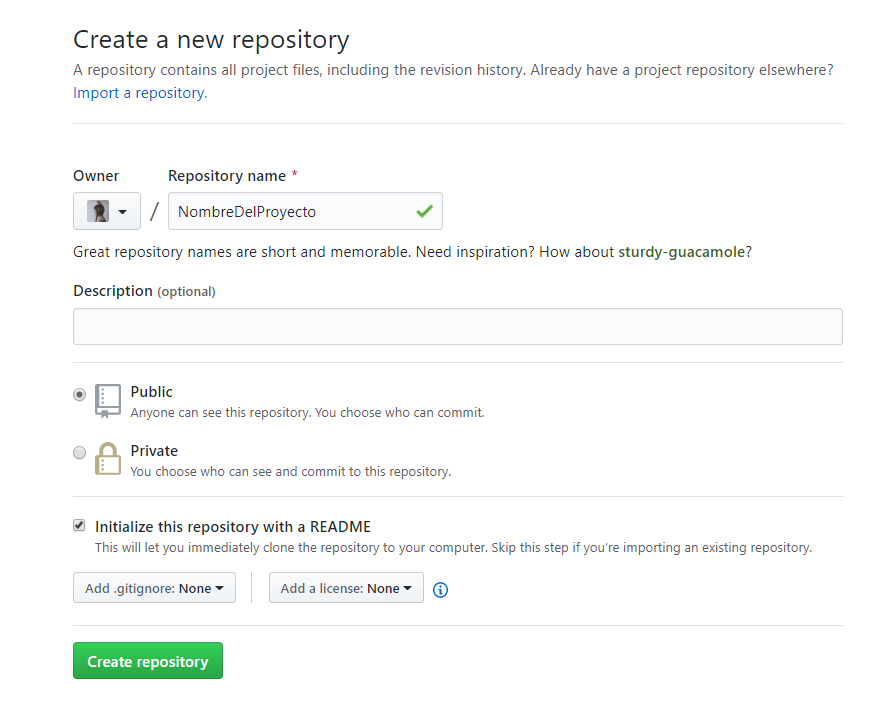

Una vez que el repositorio este creado nos redireccionara a la vista del proyecto

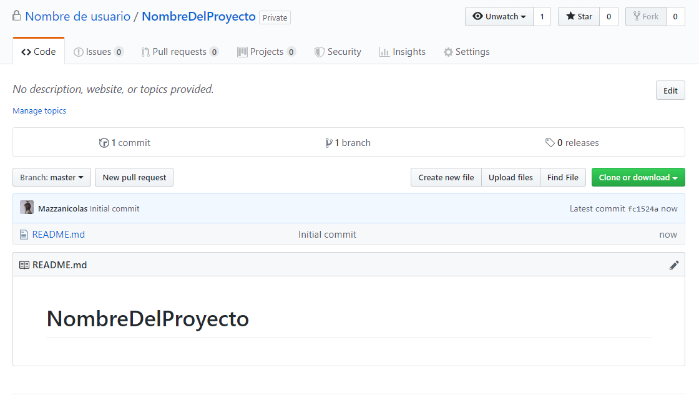

El repositorio esta creado y guardado, pero esta en los servidores de GitHub. Ahora vamos a descargarlo en nuestra computadora agregar un archivo y subirlo.

Primero vamos a abrir la consola/powershell/terminal dependiendo del sistema operativo y vamos a ingresar los siguientes comandos:

1 - Vamos a hacer un par de configuraciónes con el git.

Vamos a darnos un nombre

`git config --global user.name "John Doe"`

Vamos a ingresar el correo con el que nos creamos la cuenta de git

`git config --global user.email "johndoe@example.com"`

La consola no nos va a dar ninguna respuesta, simplemente va a saltar a una nueva linea (si todo salio correctamente).

2 - Vamos a descargar nuestro proyecto, para esto volvemos a nuestro proyecto en github y seleccionamos el botón **Clone or download** (nos aseguramos que diga Clone with HTTPS en la parte superior) y copiamos la url que nos aparece.

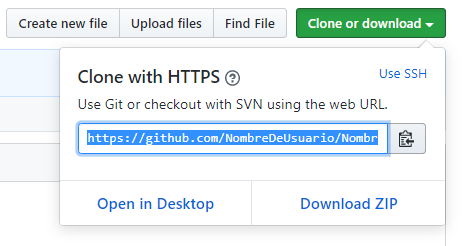

Volvemos a la consola y usamos el comando **git clone** seguido de la url que acabamos de copiar para descargarlo.

**Nota:** *Esto nos va a descargar el proyecto en la carpeta que se encuentre ubicada la consola, si estamos en **C:\\** lo va a descargar en **C:\\**. Para ver las carpetas que estan en la ubicación actual de la consola usamos `dir` (en windows) `ls` (en Mac/Linux). Para entrar a una de esas carpetas usamos `cd nombreDeLaCarpeta` y para retroceder a la carpeta anterior usamos `cd ..`*

`git clone https://github.com/NombreDeUsuario/NombreDelProyecto.git`

La primera vez puede pedirnos el usuario y contraseña de github y deberíamos de ver un mensaje similar en la consola.

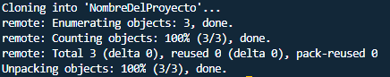

Luego podemos hacer `cd NombreDelProyecto` para entrar en la carpeta y `dir` o `ls` para confirmar que tenemos el archivo README.md que creamos con nuestro proyecto.

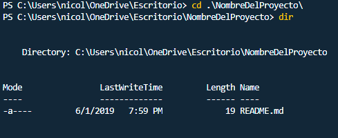

Ahora vamos a agregar un archivo, los que esten en Mac pueden escribir en la consola `open .` para abrir la carpeta en la cual se encuentran, los usuarios de windows tendrán que buscarla desde el explorador de archivos. Una vez abierta la carpeta podrán ver el archivo README.md que creamos (si no ven la carpeta **.git** es porque tienen escondidos los archivos ocultos, esto no es de importancia).

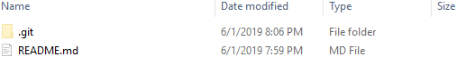

Vamos a crear un nuevo archivo de texto y llamarlo `archivo.py` (si nos sale un cartel le damos que si y si ya tenemos instalado python nos va a cambiar el icono).

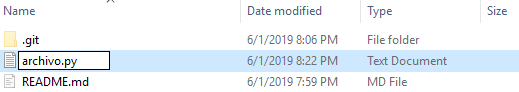

Ya que estamos vamos a editar el archivo README.md, para esto podemos usar el procesador de texto de nuestra preferencia, por ejemplo el Bloc de Notas o Notepad. Una vez abierto el archivo README.md debería tener dentro algo similar:

```
# NombreDelProyecto
```

Vamos a remplazar esto por:

**Nota:** *Pueden poner lo que quieran, lo importante es modificarlo.*

```
# Nombre Del Proyecto

Este es un proyecto de prueba que tiene un archivo `archivo.py` y un `README.md`
```

Guardamos los cambios, cerramos y volvemos a la consola. Vamos a ver los cambios realizados con el siguiente comando:

`git status`

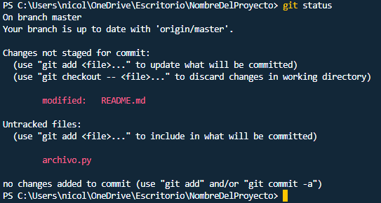

Podemos ver primero en rojo que el archivo `README.md` fue modificado y luego que se creo un `archivo.py`. Ahora vamos a iniciar el proceso en el cual seleccionamos que archivos queremos subir, le damos un nombre a la versión y los subimos.

1 - Seleccionar archivos para subir.

Para esto usamos el comando **git add** seguido del nombre del archivo a agregar. También podemos uasr **git add .** para agregar todos los archivos. Vamos a agregar el **archivo.py** y usar el comando **git status** para ver si se agrego correctamente.

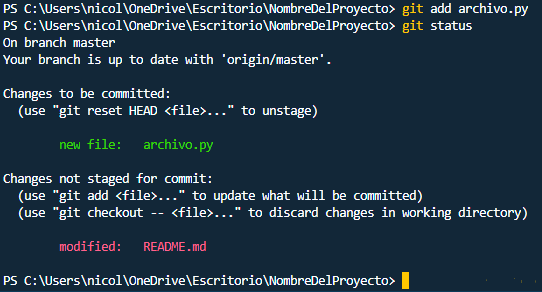

Podemos ver como ahora el archivo aparece listo para subir (a subir un archivo o conjunto de archivos se le dice **commit**).

Vamos a agregar el **README.md** de la misma forma.

`git add README.md`

Una vez que los archivos esten listos para subir (*commitear*) tenemos que darle un nombre a la versión o una descripción, para esto usamos *git commit -m* segudio de un mensaje o nombre entre comillas dobles `"`.}

`git commit -m "Nuevo archivo y cambio a README"`

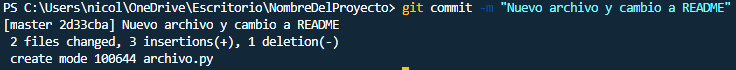

Podemos ver que los cambios están listos para subir y usamos el comando **git push** para subirlos a github. Si hasta el momento no nos pidió usuario y contraseña, ahora nos va hacer autenticar para poder subir los cambios.

`git push`

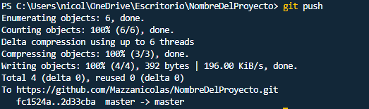

Listo! Ahora podemos volver a la página de GitHub, refrescarla (F5 / Ctrl+Shift+R) y ver los cambios.

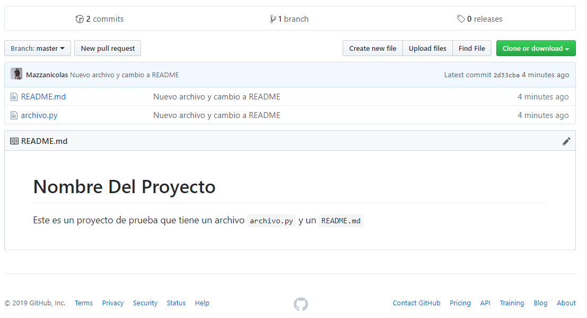

## Referencias y links relevantes

* [Documentación oficial de GIT](https://git-scm.com/doc)
* [Más información sobre que es GIT (github)](https://www.howtogeek.com/180167/htg-explains-what-is-github-and-what-do-geeks-use-it-for/)
* [Información sobre markdown](https://es.wikipedia.org/wiki/Markdown)

<br><br>