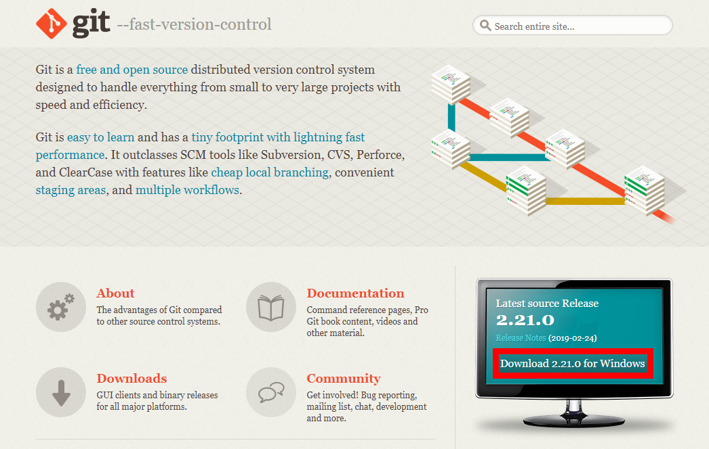
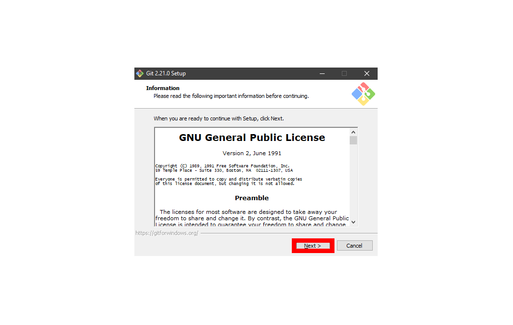
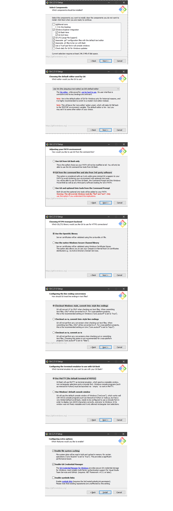
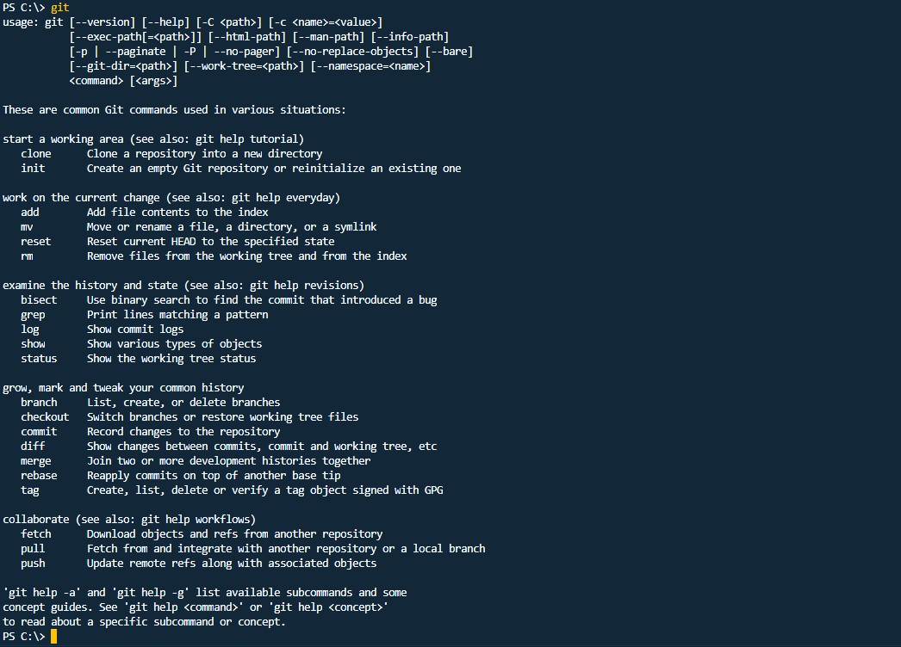

    

# Introducción a GIT

  

  

## 1. ¿Qué es y para que se puede usar?

Git es un software de control de versionado, pensando en la eficiencia y la confiabilidad del mantenimiento de versiones de aplicaciones cuando éstas tienen un gran número de archivos.

Nos permite tomar un proyecto en el cual estamos trabajando de forma local (en nuestro equipo) y guardarlo de forma segura en un servidor remoto (probablemente internet). Con unos simples comandos nos permite sincronizar los archivos locales y remotos manteniendo un historial de las diferentes versiones. Con esto ultimo siempre tenemos la posibilidad de volver a una version anterior. También nos permite compartir los proyectos con otras personas, trabajar en equipos y muchas otras funcionalidades que no vamos a mencionar.

Pero, ¿donde exactamente se están guardando los proyectos?
Existen varios sitios que ofrecen estos servicios (con tanto planes gratuitos como pagos) por nombrar algunos tenemos:

* [GitHub](https://github.com)

* [GitLab](https://about.gitlab.com)

* [BitBucket](https://bitbucket.org)

## 2. Instalación

1 - Descargar desde la [página oficial](https://git-scm.com/).

2 - Aceptar la Licencia

3 - Continuar dando next seleccionando las siguientes opciónes (deberían ser las por defecto)

4 - Para asegurarse de que la instalación fue exitosa se pueden seguir los siguientes pasos:

* Abrir al consola/powershell/terminal dependiendo del sistema operativo
* Pegar el siguiente comando `git` y presionar enter.
* La salida debería ser similar a esta imágen

## 3. Comandos básicos

**Nota:** *Los métodos y comandos que vamos a utilizar pueden no ser los mejores, pero a mi consideración, son los mas simples para las personas que no tienen conocimientos informáticos.*

## Referencias y links relevantes

* [Documentación oficial de GIT](https://git-scm.com/doc)
* [Más información sobre que es GIT (github)](https://www.howtogeek.com/180167/htg-explains-what-is-github-and-what-do-geeks-use-it-for/)

  